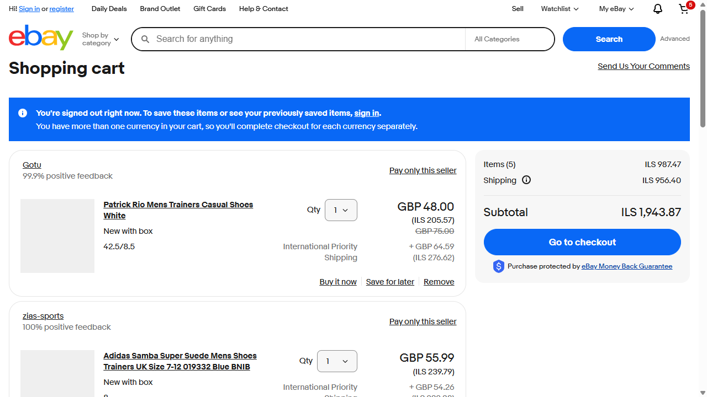
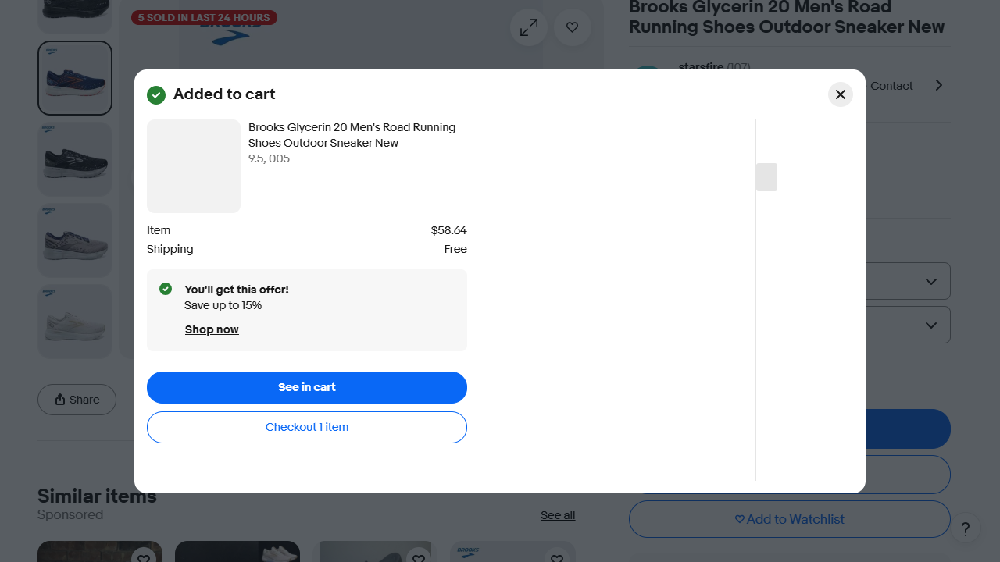
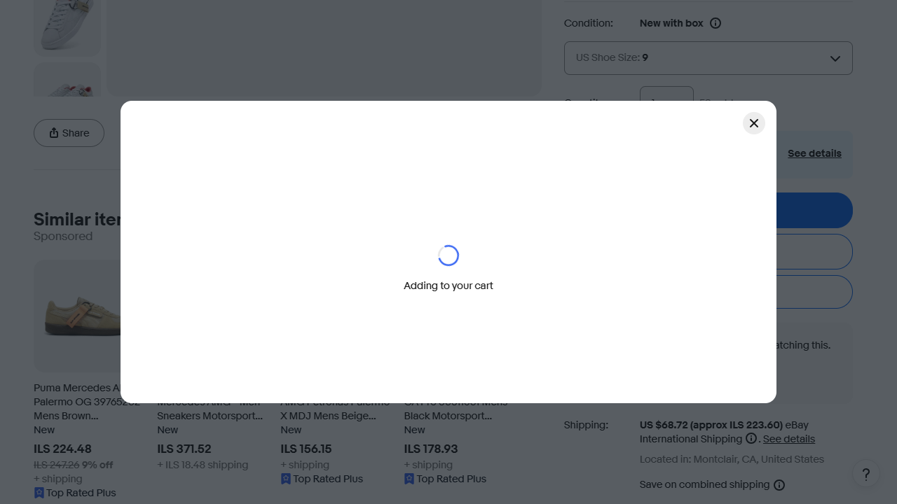
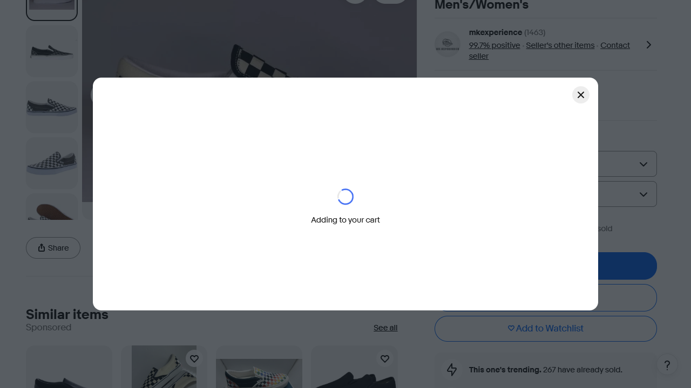
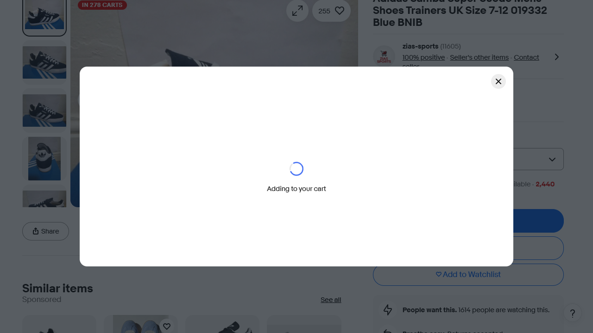
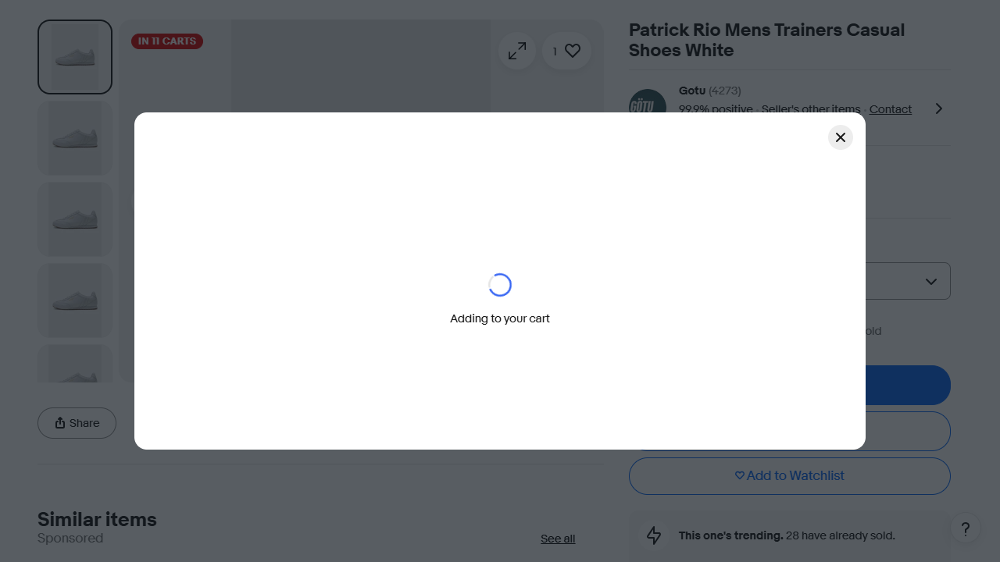
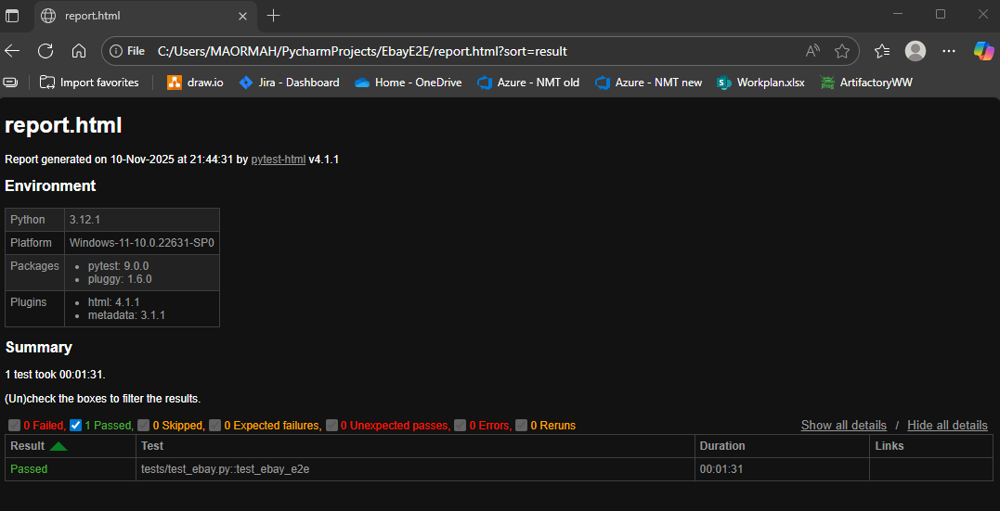

##---This project was developed by Maor Maharizi---##

# EbayE2E

The EbayE2E project performs automated end-to-end testing for the eBay website.
The project is built using the Page Object Model (POM) architecture and utilizes Playwright for automation.

# Coverage

1. Handling the first default item - advertisement
2. Handling items without prices
3. Handling items without links
4. Handling an invalid value in the price of an item (not a number)
5. Handling only Israeli currency (ILS) 
6. Handling duplicate items - the same link
7. Handling the default value of LISTBOX ("select" option in size/color lןst boxes)
8. Handling DISABLED values of LISTBOX (size/color lןst boxes)
9. No price range handling
10. No shipping charges handling

# Table of Contents

1. Objective
2. Technologies
3. Project Architecture
4. Installation
5. Execution
6. Reports and Documentation
7. Screenshots
8. Test Scenarios
9. Conclusion

# Objective

The goal of this project is to enable E2E (End-to-End) testing on eBay automatically.
The project allows testing:
1. Searching for items price.
2. Checking item availability.
3. Collecting information about search results.
4. Generating summary reports of the tests.

# Technologies

Programming Language: Python 3.11+
Libraries: Playwright, Pytest
Project Management: Git
Automated Reports: Allure / Pytest HTML

# Project Architecture

Built using the Page Object Model (POM):
EbayE2E/
│
├── .venv/                # data files
│
├── data/                # data files
│   ├── config.json
│
├── pages/                # Page files with functions for each page
│   ├── base_page.py
│   ├── cart_page.py
│   ├── item_page.py
│   ├── login_page.py
│   └── search_page.py
│
├── tests/                # Test files
│   └── test_ebay.py
│
├── screenshots/          # Screenshots of the tests
│   └── cart_total.png
│
├── reports/              # Reports generated after execution
│   └── allure-results/
│
├── utils/                # Public functions
└── README.md

# Installation

Create a virtual environment: (Python Teminal)
python -m venv venv

Activate it:
Windows: venv\Scripts\activate
Mac/Linux: source venv/bin/activate

Install dependencies:
pip install -r requirements.txt

Install browsers for Playwright:
playwright install

# Execution

Run all tests:
pytest --alluredir=reports/allure-results

Generate an HTML report with Allure:
allure serve reports/allure-results

# Reports and Documentation

Allure Reports provide - Test status (Pass/Fail)
file:///C:/Users/MAORMAH/PycharmProjects/EbayE2E/report.html

# Screenshots

Example screenshots from test execution:

# Test Scenarios

1. Login as a guest user
2. Search for items by maximum price
3. Add the found items to the shopping cart
4. Verify that the total cart amount does not exceed a predefined budget

# Conclusion

The EbayE2E project enables reliable and efficient automation of eBay testing, provides detailed reports and screenshots
